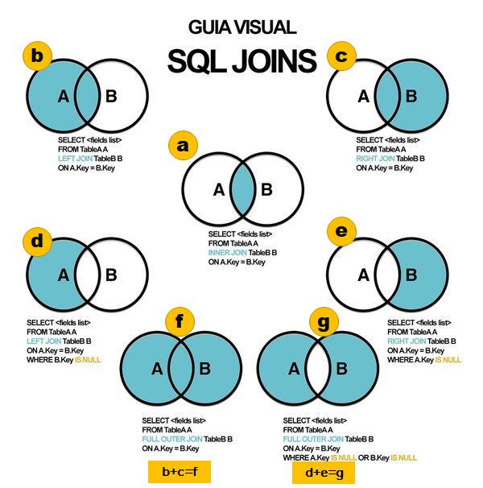

# JOIN多資料表查詢

## 交叉連結Cross Join(p.122)

使用兩個表格的資料來產生測試用資料。這個連結比較少用到。

以下範例，e1和e2是別名(是為了縮寫方便用的)\
若兩表格有一樣的欄位，但不給他表格名，系統會不知道你要哪個表格的欄位

`SELECT e1.ename, e2.job`\
`FROM emp e1 CROSS JOIN emp e2;`

## 內部連結Inner Join(p.123)

### 自然連結Natural Join(p.123)

* 相同欄位名稱做連結依據
* 缺點：若欄位名稱型態不同時，則產生錯誤訊息



`SELECT e.ename, e.job, e.sal, e.deptno, d.dname, d.loc`\
`FROM emp e NATURAL JOIN dept d;`



指定欄位做連結條件(p.124)

`SELECT a.empno, a.ename, a.mgr, a.sal, a.deptno, b.deptno,b.dname`\
`FROM emp a JOIN dept b USING(deptno)`\
`WHERE deptno = 10;`


USING()內不可以使用關係名稱，\
例如❌USING(a.deptno)





### 相等連結Equal Joins(p.125)



ON設定**連結條件**

\-- 為解決自然連結(NATURAL JOIN)的缺點，可使用ON = 的條件

`SELECT e.ename, e.job, e.sal, e.deptno, d.dname, d.loc`\
`FROM emp e JOIN dept d ON(e.deptno=d.deptno);`

備註：ON後面括號可加可不加。



查詢條件+WHERE(p.126)\
範例：列出員工姓名KING所在的部門資訊。

`SELECT a.empno,a.ename,a.mgr,a.sal,a.deptno,b.deptno,b.dname`\
`FROM emp a JOIN dept b ON a.deptno = b.deptno`\
`WHERE a.ename = 'KING';`





(p.128)範例：計算員工業績(emp表格、custmoer表格、ord表格)

`SELECT a.empno,a.ename,sum(c.total) 'total'`\
`FROM emp a JOIN customer b ON a.empno = b.repid`\
&#x9;   `JOIN ord c ON b.custid = c.custid`\
`GROUP BY a.empno, a.ename;`



### 不相等連結Non-Equi joins(p.129)



\-- 內部連結－不相等連結>=或<=、BETWEEN AND

`SELECT a.empno, a.ename, a.sal, b.grade`\
`FROM emp a JOIN salgrade b` \
&#x20;          `ON(a.sal BETWEEN b.losal AND b.hisal);`

\-- 範例二：列出所有員工薪資的等級(BETWEEN AND)

`SELECT a.empno,a.ename,a.sal,b.grade`\
`FROM emp a JOIN salgrade b` \
&#x20;          `ON (a.sal BETWEEN b.losal AND b.hisal);`




## 外部連結Outer Join(p.130)

* 「left outer join」以命令「左方」的表格判斷
* 「right outer join」以命令「右方」的表格判斷



\-- 列出所有部門下的員工(p.131)

`SELECT a.deptno, a.dname, b.empno, b.ename`\
`FROM dept a LEFT OUTER JOIN emp b` \
&#x20;           `ON a.deptno = b.deptno;`





\-- 列出沒有員工的部門(p.131)

`SELECT e.ename, e.deptno, d.dname, d.loc`\
`FROM emp e RIGHT OUTER JOIN dept d` \
&#x20;          `ON e.deptno = d.deptno`\
`WHERE e.empno is NULL;`



## 自我連結Self Joins(p.132)



\-- 用員編找主管資訊

`SELECT a.empno, a.ename, a.mgr, b.ename`\
`FROM emp a JOIN emp b` \
&#x20;          `ON a.mgr = b.empno`\
`ORDER BY a.mgr;`



## JOIN的意義(p.133)





**Left Outer Join** + **Right Outer Join** = Outer Join | Full Outer Join | **Full Join**

`SELECT <select_list> FROM`\
`tableA a LEFT JOIN tableB b`\
`ON a.key=b.key`\
`UNION🔸`\
`SELECT <select_list> FROM`\
`tableA a RIGHT JOIN tableB b`\
`ON a.key=b.key`



**Left Excluding Join** + **Right Excluding Join** = **Outer Excluding Join**

`SELECT <select_list> FROM`\
`tableA a LEFT JOIN tableB b`\
`ON a.key=b.key`\
`WHERE b.key IS NULL`\
`UNION🔸`\
`SELECT <select_list> FROM`\
`tableA a RIGHT JOIN tableB b`\
`ON a.key=b.key`\
`WHERE a.key IS NULL`




## 作業練習－DQL-JOIN(p.134)

1. 顯示所有員工之姓名，所屬部門編號，部門名稱及部門所在地點。
2. 顯示所有有賺取佣金的員工之姓名，佣金金額，部門名稱及部門所在地點。
3. 顯示姓名中包含有"A"的員工之姓名及部門名稱。
4. 顯示所有在"DALLAS"工作的員工之姓名，職稱，部門編號及部門名稱。
5. 顯示出表頭名為：employee, emp#, Manager, mgr#，分別表示所有員工之姓名，員工編號，主管姓字，主管的員工編號。
6. 顯示出SALGRADE資料表的結構，並建立一查詢顯示所有員工之姓名，職稱，部門名稱，薪資及薪資等級。
7. 🟡顯示出表頭名為：employee,emp hiredate, manager, mgr hiredate的資料項。來顯示所有比他的主管還要早進公司的員工之姓名，進公司日期和主管之姓名及進公司日期。
8. 顯示出表頭名為：dname, loc, number of people, salary的資料來顯示所有部門之部門名稱，部門所在地，部門員工數量及部門員工的平均薪資，平均薪資四捨五入取到小數第二位。



```
-- 顯示所有員工之姓名，所屬部門編號，部門名稱及部門所在地點。
SELECT e.ename, e.deptno, d.dname, d.loc 
	FROM emp e JOIN dept d ON e.deptno=d.deptno;
+--------+--------+------------+----------+
| ename  | deptno | dname      | loc      |
+--------+--------+------------+----------+
| CLARK  |     10 | ACCOUNTING | NEW YORK |
| KING   |     10 | ACCOUNTING | NEW YORK |
| MILLER |     10 | ACCOUNTING | NEW YORK |
| SMITH  |     20 | RESEARCH   | DALLAS   |
| JONES  |     20 | RESEARCH   | DALLAS   |
| SCOTT  |     20 | RESEARCH   | DALLAS   |
| ADAMS  |     20 | RESEARCH   | DALLAS   |
| FORD   |     20 | RESEARCH   | DALLAS   |
| ALLEN  |     30 | SALES      | CHICAGO  |
| WARD   |     30 | SALES      | CHICAGO  |
| MARTIN |     30 | SALES      | CHICAGO  |
| BLAKE  |     30 | SALES      | CHICAGO  |
| TURNER |     30 | SALES      | CHICAGO  |
| JAMES  |     30 | SALES      | CHICAGO  |
+--------+--------+------------+----------+
14 rows in set (0.00 sec)
```



```
-- 顯示所有有賺取佣金的員工之姓名，佣金金額，部門名稱及部門所在地點。
SELECT e.ename, e.comm, d.dname, d.loc 
	FROM emp e JOIN dept d ON e.deptno=d.deptno 
  WHERE e.comm >0;
+--------+---------+-------+---------+
| ename  | comm    | dname | loc     |
+--------+---------+-------+---------+
| ALLEN  |  300.00 | SALES | CHICAGO |
| WARD   |  500.00 | SALES | CHICAGO |
| MARTIN | 1400.00 | SALES | CHICAGO |
+--------+---------+-------+---------+
3 rows in set (0.00 sec)
```



```
-- 顯示姓名中包含有"A"的員工之姓名及部門名稱。
SELECT e.ename, d.dname 
	FROM emp e JOIN dept d ON e.deptno=d.deptno 
  WHERE e.ename LIKE '%A%';
+--------+------------+
| ename  | dname      |
+--------+------------+
| ALLEN  | SALES      |
| WARD   | SALES      |
| MARTIN | SALES      |
| BLAKE  | SALES      |
| CLARK  | ACCOUNTING |
| ADAMS  | RESEARCH   |
| JAMES  | SALES      |
+--------+------------+
7 rows in set (0.00 sec)
```



```
-- 顯示所有在"DALLAS"工作的員工之姓名，職稱，部門編號及部門名稱。
SELECT e.ename, e.job, e.deptno, d.dname 
	FROM emp e JOIN dept d ON e.deptno=d.deptno 
  WHERE d.loc='DALLAS';
+-------+---------+--------+----------+
| ename | job     | deptno | dname    |
+-------+---------+--------+----------+
| SMITH | CLERK   |     20 | RESEARCH |
| JONES | MANAGER |     20 | RESEARCH |
| SCOTT | ANALYST |     20 | RESEARCH |
| ADAMS | CLERK   |     20 | RESEARCH |
| FORD  | ANALYST |     20 | RESEARCH |
+-------+---------+--------+----------+
5 rows in set (0.00 sec)
```



```
/*顯示出表頭名為：employee, emp#, Manager, mgr#，
分別表示所有員工之姓名，員工編號，主管姓字，主管的員工編號。*/
SELECT e1.ename 'Employee', 
			e1.empno 'Emp#', e2.ename 'Manager', e2.empno 'Mgr#' 
	FROM emp e1 JOIN emp e2 ON e1.mgr=e2.empno;
+----------+------+---------+------+
| Employee | Emp# | Manager | Mgr# |
+----------+------+---------+------+
| SMITH    | 7369 | FORD    | 7902 |
| ALLEN    | 7499 | BLAKE   | 7698 |
| WARD     | 7521 | BLAKE   | 7698 |
| JONES    | 7566 | KING    | 7839 |
| MARTIN   | 7654 | BLAKE   | 7698 |
| BLAKE    | 7698 | KING    | 7839 |
| CLARK    | 7782 | KING    | 7839 |
| SCOTT    | 7788 | JONES   | 7566 |
| TURNER   | 7844 | BLAKE   | 7698 |
| ADAMS    | 7876 | SCOTT   | 7788 |
| JAMES    | 7900 | BLAKE   | 7698 |
| FORD     | 7902 | JONES   | 7566 |
| MILLER   | 7934 | CLARK   | 7782 |
+----------+------+---------+------+
13 rows in set (0.00 sec)
```



```
/*顯示出SALGRADE資料表的結構，
並建立一查詢顯示所有員工之姓名，職稱，部門名稱，薪資及薪資等級。*/
DESCRIBE salgrade;
SELECT e.ename, e.job, d.dname, s.grade 
	FROM emp e JOIN dept d ON (e.deptno=d.deptno) 
			   		 JOIN salgrade s 
							ON (e.sal BETWEEN s.losal AND s.hisal);
+-------+--------------+------+-----+---------+-------+
| Field | Type         | Null | Key | Default | Extra |
+-------+--------------+------+-----+---------+-------+
| GRADE | tinyint      | YES  |     | NULL    |       |
| LOSAL | decimal(7,2) | YES  |     | NULL    |       |
| HISAL | decimal(7,2) | YES  |     | NULL    |       |
+-------+--------------+------+-----+---------+-------+
3 rows in set (0.00 sec)

+--------+-----------+------------+-------+
| ename  | job       | dname      | grade |
+--------+-----------+------------+-------+
| SMITH  | CLERK     | RESEARCH   |     1 |
| ALLEN  | SALESMAN  | SALES      |     3 |
| WARD   | SALESMAN  | SALES      |     2 |
| JONES  | MANAGER   | RESEARCH   |     4 |
| MARTIN | SALESMAN  | SALES      |     2 |
| BLAKE  | MANAGER   | SALES      |     4 |
| CLARK  | MANAGER   | ACCOUNTING |     4 |
| SCOTT  | ANALYST   | RESEARCH   |     4 |
| KING   | PRESIDENT | ACCOUNTING |     5 |
| TURNER | SALESMAN  | SALES      |     3 |
| ADAMS  | CLERK     | RESEARCH   |     1 |
| JAMES  | CLERK     | SALES      |     1 |
| FORD   | ANALYST   | RESEARCH   |     4 |
| MILLER | CLERK     | ACCOUNTING |     2 |
+--------+-----------+------------+-------+
14 rows in set (0.00 sec)
```



```
/*顯示出表頭名為：employee,emp hiredate, manager, mgr hiredate的資料項。
來顯示所有比他的主管還要早進公司的員工之姓名，進公司日期和主管之姓名及進公司日期。
*/
SELECT e1.ename 'Employee', 
       e1.hiredate 'Emp Hiredate', 
       e2.ename 'Manager', e2.hiredate 'Mgr Hiredate' 
	FROM emp e1 JOIN emp e2 ON (e1.empno=e2.mgr) 
  WHERE e1.hiredate < e2.hiredate;
+----------+---------------------+---------+---------------------+
| Employee | Emp Hiredate        | Manager | Mgr Hiredate        |
+----------+---------------------+---------+---------------------+
| BLAKE    | 1981-05-01 00:00:00 | MARTIN  | 1981-09-28 00:00:00 |
| JONES    | 1981-04-02 00:00:00 | SCOTT   | 1982-12-09 00:00:00 |
| BLAKE    | 1981-05-01 00:00:00 | TURNER  | 1981-09-08 00:00:00 |
| SCOTT    | 1982-12-09 00:00:00 | ADAMS   | 1983-01-12 00:00:00 |
| BLAKE    | 1981-05-01 00:00:00 | JAMES   | 1981-12-03 00:00:00 |
| JONES    | 1981-04-02 00:00:00 | FORD    | 1981-12-03 00:00:00 |
| CLARK    | 1981-06-09 00:00:00 | MILLER  | 1982-01-23 00:00:00 |
+----------+---------------------+---------+---------------------+
7 rows in set (0.00 sec)
```



```
/*顯示出表頭名為：dname, loc, number of people, salary的資料
來顯示所有部門之部門名稱，部門所在地，
部門員工數量及部門員工的平均薪資，平均薪資四捨五入取到小數第二位。*/

SELECT d.dname 'dname', 
       d.loc 'loc', 
       COUNT(*) 'Number of People', 
       ROUND(AVG(e.sal),2) 'Salary' 
	FROM dept d JOIN emp e ON (d.deptno=e.deptno) 
  GROUP BY d.deptno;
+------------+----------+------------------+---------+
| dname      | loc      | Number of People | Salary  |
+------------+----------+------------------+---------+
| RESEARCH   | DALLAS   |                5 | 2175.00 |
| SALES      | CHICAGO  |                6 | 1566.67 |
| ACCOUNTING | NEW YORK |                3 | 2916.67 |
+------------+----------+------------------+---------+
3 rows in set (0.00 sec)
```


